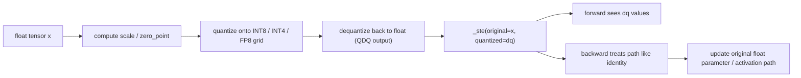
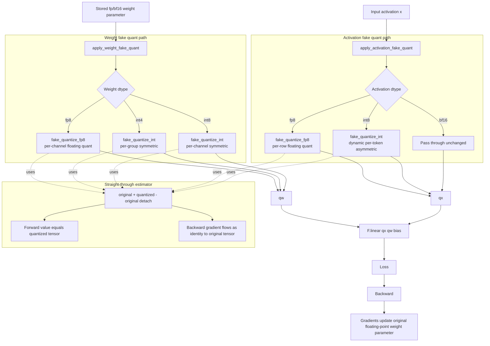

# QAT

Lightweight quantization-aware training experiments for `Qwen/Qwen3-4B` on `AI-MO/NuminaMath-CoT`.

## Overview

This repo provides a small single-GPU workflow for:

- baseline bf16 supervised fine-tuning
- QAT fine-tuning for supported quantization variants
- export to standalone model artifacts
- vLLM-based inference and NuminaMath evaluation

The interface is intentionally split into two stages:

- `train`: train + export only
- `eval`: vLLM loadability check + inference + evaluation only

That keeps long-running training separate from inference/evaluation and makes it easy to re-evaluate an existing exported artifact.

## Environment

- Python `3.12+`
- CUDA-visible GPU through `CUDA_VISIBLE_DEVICES`
- Hopper-class or newer GPU for this project’s preflight gate: compute capability `>= 9.0`
- Installed runtime packages: `torch`, `transformers`, `datasets`, `trl`, `vllm`, `compressed-tensors`

The code does not take a `gpu_index` flag. Set the device externally, for example:

```bash
CUDA_VISIBLE_DEVICES=5 uv run python -m qat.preflight --variant int8_bf16
```

## Data Splits

Named splits are built from `AI-MO/NuminaMath-CoT` with deterministic seeds:

- `smoke`: train `500`, test `100`
- `full`: train `5000`, test `500`

## Supported Variants

QAT mode supports:

- `fp8_bf16`
- `int8_bf16`
- `fp8_fp8`
- `int8_int8`
- `int4_fp8`
- `int4_bf16`

Baseline mode does not take a quantization variant.

## Artifact Layout

The default artifact root is:

```text
ptq_experiments/artifacts_qat
```

Train artifacts are written under:

```text
<artifact_root>/<run_id>/
```

Examples:

- `baseline-smoke-baseline-seed17`
- `qat-smoke-int8_bf16-seed17`

Each trained artifact includes `train_config.json`.

Evaluation writes:

- metrics CSV to the chosen `--output-path`
- `predictions_<run_id>.json` next to the metrics file
- `eval_config_<run_id>.json` next to the metrics file

## Commands

### Train baseline smoke

```bash
CUDA_VISIBLE_DEVICES=5 uv run python -m qat.cli train \
  --type smoke \
  --mode baseline \
  --seed 17
```

### Train QAT smoke

```bash
CUDA_VISIBLE_DEVICES=5 uv run python -m qat.cli train \
  --type smoke \
  --mode qat \
  --seed 17 \
  --quantization-variant int8_bf16
```

### Train QAT with custom optimizer settings

```bash
CUDA_VISIBLE_DEVICES=5 uv run python -m qat.cli train \
  --type full \
  --mode qat \
  --seed 17 \
  --quantization-variant int8_int8 \
  --training.learning-rate 2e-5 \
  --training.weight-decay 0.01 \
  --training.warmup-ratio 0.03 \
  --training.max-grad-norm 1.0 \
  --training.num-epochs 1
```

### Train with `torch.compile`

Train accepts `--compile` with:

- `disabled`
- `try`
- `required`

Example:

```bash
CUDA_VISIBLE_DEVICES=5 uv run python -m qat.cli train \
  --type smoke \
  --mode qat \
  --seed 17 \
  --quantization-variant int8_int8 \
  --compile required
```

### Evaluate from resolved artifact path

If `--model-path` is omitted, the code resolves the artifact path from `--type`, `--mode`, `--seed`, and `--quantization-variant`.

```bash
CUDA_VISIBLE_DEVICES=5 uv run python -m qat.cli eval \
  --type smoke \
  --mode qat \
  --seed 17 \
  --quantization-variant int8_int8
```

### Evaluate an explicit artifact

```bash
CUDA_VISIBLE_DEVICES=5 uv run python -m qat.cli eval \
  --type smoke \
  --mode baseline \
  --seed 17 \
  --model-path ptq_experiments/artifacts_qat/baseline-smoke-baseline-seed17 \
  --output-path ptq_experiments/artifacts_qat/metrics_numinamath_cot.csv
```

### Run preflight only

```bash
CUDA_VISIBLE_DEVICES=5 uv run python -m qat.preflight --variant fp8_fp8
```

## Notes

- `eval` uses the repo’s vLLM evaluation flow, not a separate ad hoc inference script.
- The eval path currently performs a loadability check before the actual evaluation pass, so the model is loaded twice per eval run.
- Known FP8 serving failures will surface during the loadability gate before generation starts.
- QAT uses fake quantization with an explicit straight-through estimator in [`src/qat/quantization/qat.py`](src/qat/quantization/qat.py): the forward pass uses the quantized value while the backward pass flows through the original tensor via `original + (quantized - original).detach()`.

## Symmetric vs Asymmetric

This repo uses different quantization styles for weights and activations:

- weights use symmetric quantization for INT8 and INT4
- INT8 activations use asymmetric quantization
- FP8 paths are zero-centered in practice, but they use FP8 scale-based quantization instead of integer affine quantization with a learned zero-point

The practical reason is:

- weights are usually centered around zero, so symmetric quantization with `zero_point = 0` is a good fit and matches the exported compressed weight formats
- activations are input-dependent and can be shifted away from zero, so asymmetric INT8 quantization uses a learned zero-point to cover the observed range more efficiently
- FP8 still behaves like a zero-centered scheme here, but it is better described as scaled floating quantization than as the INT8-style symmetric/asymmetric affine case

That same policy is implemented in [`src/qat/quantization/qat.py`](src/qat/quantization/qat.py):

- `apply_weight_fake_quant(...)` uses symmetric integer quantization for `int8` and `int4`
- `apply_activation_fake_quant(...)` uses asymmetric integer quantization for `int8`

The math differs between integer affine quantization and FP8 scaling:

- integer affine quantization:
  - `q = clamp(round(x / scale) + zero_point, qmin, qmax)`
  - `x_hat = (q - zero_point) * scale`
- symmetric integer quantization:
  - `zero_point = 0`
  - `q = clamp(round(x / scale), qmin, qmax)`
  - `x_hat = q * scale`
- asymmetric integer quantization:
  - `zero_point` is learned from the observed min/max range
  - this lets the quantized grid shift away from zero
- FP8 quantization:
  - `y = x / scale`
  - `q_fp8 = cast_to_fp8(y)`
  - `x_hat = q_fp8 * scale`

So FP8 is still zero-centered in practice, but it does not use the integer affine `zero_point` mechanism that distinguishes symmetric from asymmetric INT8/INT4 quantization.

## QDQ and STE

QAT training does not run a true quantized matmul. Instead it:

1. starts from the floating-point tensor
2. quantizes it onto the target grid
3. dequantizes it back to float
4. uses STE so backward updates the original floating-point tensor

That is why the training forward pass uses float tensors whose values have already been snapped to the quantized grid. True compressed weights and quantized runtime execution happen later in the export and inference path.



## QAT Flow

This is the train-time QAT path for a wrapped `FakeQuantLinear` layer. The key idea is that the forward pass uses fake-quantized activations and weights, while the backward pass uses the straight-through estimator so gradients flow to the original floating-point tensors.



## Export Flow

This is the export-time path after QAT training has finished. At this stage we stop using `FakeQuantLinear`, recover plain `nn.Linear` modules, attach the quantization metadata expected by `compressed_tensors`, and then let its compressor rewrite the trained floating-point weights into the serialized quantized artifact.

```mermaid
flowchart TD
    A[Checkpoint dir from train step] --> B[load checkpoint model and tokenizer]
    B --> C[convert_model_from_qat]
    C --> D[FakeQuantLinear -> nn.Linear]

    D --> E[_attach_quantization_metadata]

    subgraph LocalPrep[Local export prep in this repo]
        E --> E1[get_qat_spec]
        E1 --> E2[build QuantizationScheme]
        E2 --> E3[iterate eligible Linear modules]
        E3 --> E4[initialize_module_for_quantization]
        E4 --> E5[allocate qparam buffers and attach quantization metadata]
        E5 --> E6[_min_max_for_weight]
        E6 --> E7[collect per-channel or per-group ranges]
        E7 --> E8[calculate_qparams]
        E8 --> E9[compute scale and zero_point tensors]
        E9 --> E10[copy into weight_scale and weight_zero_point buffers]
    end

    E10 --> F[ModelCompressor.from_pretrained_model]
    F --> G[compressor.compress_model]

    subgraph CompressedTensors[compressed_tensors export internals we rely on]
        G --> G1[read attached QuantizationScheme and qparam buffers]
        G1 --> G2[quantize and pack trained float weights]
        G2 --> G3[rewrite module weights into compressed representation]
    end

    G3 --> H[model.save_pretrained]
    H --> I[compressor.update_config]
    I --> J[write compressed_tensors config metadata]
    J --> K[probe_exported_model_compile]
    K --> L[verify_export_completeness]
    L --> M[final standalone artifact dir]
```



## Compile-Enabled Training

The train CLI can run with `torch.compile` through `--compile {disabled,try,required}`.

In this repo, compile-enabled training completed for the variants we probed:

- baseline bf16
- `fp8_bf16`
- `int8_bf16`
- `fp8_fp8`
- `int8_int8`
- `int4_fp8`
- `int4_bf16`

The first compiled step has large startup overhead

We also evaluated compile-trained smoke artifacts with the normal eval flow to check whether training with `torch.compile` was obviously hurting metrics. Where a non-compiled smoke score was available, results were mixed:

| Variant | Split | Non-compiled accuracy | Compile-trained accuracy |
| --- | --- | ---: | ---: |
| baseline bf16 | smoke | `0.22` | `0.25` |
| `fp8_bf16` | smoke | `0.21` | `0.22` |
| `int8_bf16` | smoke | n/a | `0.21` |
| `fp8_fp8` | smoke | `0.25` | `0.21` |
| `int4_fp8` | smoke | `0.20` | `0.21` |
| `int8_int8` | smoke | `0.28` | `0.25` |
| `int4_bf16` | smoke | `0.22` | `0.17` |

That is not enough evidence to claim a universal regression, but it does mean compile-enabled training should currently be treated as experimental rather than a default setting for accuracy-sensitive runs.

## Full-Run Comparison

On the full `NuminaMath-CoT` split used in this repo (`5000` train, `500` eval), the observed accuracies were:

| Run | Artifact | Method | Quantization | Accuracy |
| --- | --- | --- | --- | ---: |
| baseline bf16 | `baseline-full-baseline-seed17` | SFT baseline | `bf16/bf16` | `0.202` |
| QAT `fp8_bf16` | `qat-full-fp8_bf16-seed17` | QAT | `FP8/BF16` | `0.216` |
| QAT `int8_bf16` | `qat-full-int8_bf16-seed17` | QAT | `W8A16` | `0.208` |
| QAT `fp8_fp8` | `qat-full-fp8_fp8-seed17` | QAT | `W8A8 FP8` | `0.212` |
| QAT `int8_int8` | `qat-full-int8_int8-seed17` | QAT | `W8A8 INT8` | `0.200` |
| QAT `int4_fp8` | `qat-full-int4_fp8-seed17` | QAT | `W4A8 FP8` | `0.174` |
| QAT `int4_bf16` | `qat-full-int4_bf16-seed17` | QAT | `W4A16` | `0.186` |
| PTQ dynamic `W8A8 INT8` | `model` | PTQ from the full baseline artifact | `W8A8 INT8` | `0.188` |

The direct QAT-vs-PTQ comparison is the `int8_int8` row: QAT stayed close to the `0.202` baseline at `0.200`, while the corresponding dynamic PTQ `W8A8 INT8` artifact evaluated at `0.188` on the same evaluation flow. That does not prove a universal rule, but it is the practical outcome this repo was built to study.
